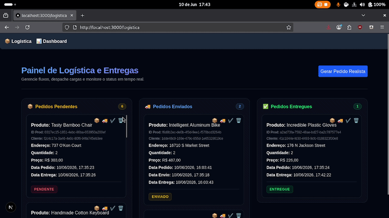
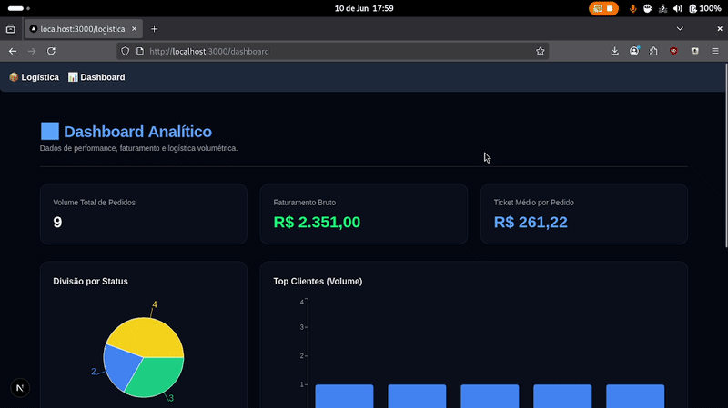

# SLE - Sistema de Logística de Entrega 🚀

The **SLE (Logistics Delivery System)** is a centralized platform for managing logistics flows. The system enables the registration and tracking of corporate orders, ensuring full visibility of delivery statuses from origin to final destination through an intuitive interface and BI-focused dashboards.

---

## 📸 System Demonstration

### 🚛 Logistics Page (Operational)
On this page, you can view the list of all orders, filter by status (Pending, In Transit, Delivered), and access order details including Order ID, Customer ID, and Product ID.

<p align="center">
  
</p>

---

### 📊 Dashboard Page (BI & Analytics)
On this page, administrators have access to professional dashboards built with **Recharts**. View real-time performance metrics, bar charts on delivery volume, and pie charts for status distribution, enabling data-driven strategic decisions.

<p align="center">
  
</p>

---

## 🛠 Tech Stack

- **Frontend:** Next.js (React) with TailwindCSS.
- **Backend:** Django (Python).
- **Visualization:** Recharts.
- **Data:** Integrated Fake API for dynamic simulation.

---

### 🐳 How to run with Docker

```bash
# 1. Clone the repository
git clone https://github.com/seu-usuario/sistema-logistica-entregas.git
cd sistema-logistica-entregas

# 2. Set up environment
cp .env.example .env
cp .env.example backend/.env
nano .env  # edit with your settings

# 3. Start the containers
docker compose up --build
```

### 🇧🇷 Versão em Português

```markdown
# SLE - Sistema de Logística de Entrega 🚀

O **SLE (Sistema de Logística de Entrega)** é uma plataforma centralizada para o gerenciamento de fluxos logísticos. O sistema permite o registro e acompanhamento de pedidos de empresas, garantindo visibilidade total sobre o status das entregas, desde a origem até o destino final, através de uma interface intuitiva e dashboards focados em métricas de negócio.

---

## 📸 Demonstração do Sistema

### 🚛 Página de Logística (Operacional)
Nesta página, você pode visualizar a listagem de todos os pedidos, filtrar por status (Pendente, Em Trânsito, Entregue) e acessar os detalhes de cada entrega, incluindo ID do pedido, cliente e produto.

<p align="center">
  
</p>

---

### 📊 Página de Dashboard (BI & Analítico)
Nesta página, os administradores têm acesso a dashboards profissionais construídos com **Recharts**. Visualize métricas de desempenho em tempo real, gráficos de barras sobre o volume de entregas e gráficos de pizza para distribuição de status.

<p align="center">
  
</p>

---

## 🛠 Tecnologias Utilizadas

- **Frontend:** Next.js (React) com TailwindCSS.
- **Backend:** Django (Python).
- **Visualização:** Recharts.
- **Dados:** API Fake integrada para simulação dinâmica.

---

### 🐳 Como rodar com Docker

```bash
#### Pré-requisitos
- [Docker](https://docs.docker.com/get-docker/) instalado na máquina

#### Passos

# 1. Clone o repositório
git clone https://github.com/seu-usuario/sistema-logistica-entregas.git
cd sistema-logistica-entregas

# 2. Configure o ambiente (copie o arquivo de exemplo)
cp .env.example .env
cp .env.example backend/.env

# 3. Edite o .env com suas configurações
nano .env

# 4. Suba os containers (o docker-compose.yml já está configurado)
docker compose up --build

Acesse em http://localhost:3000
```


